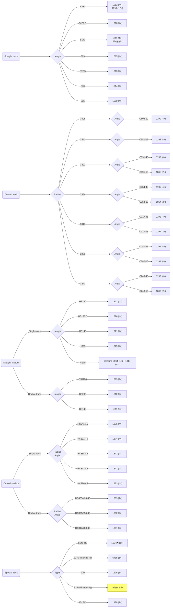
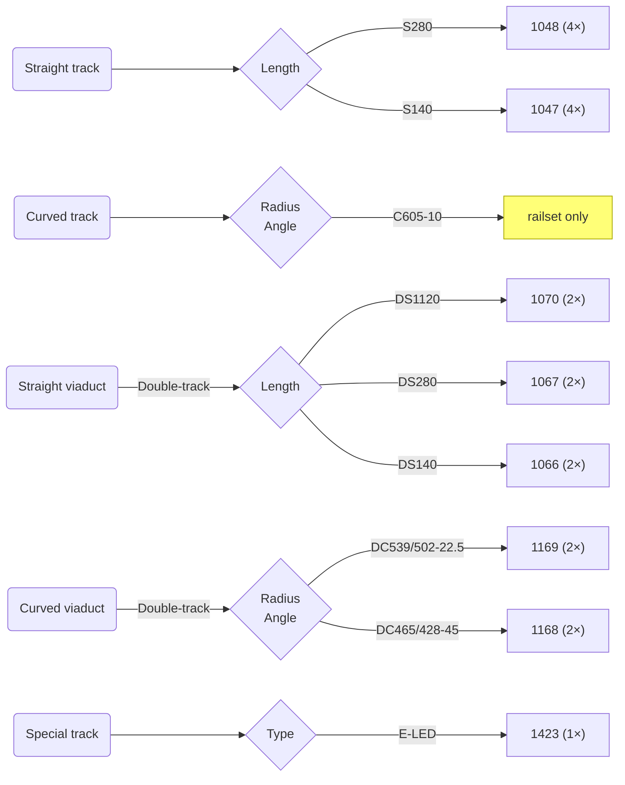
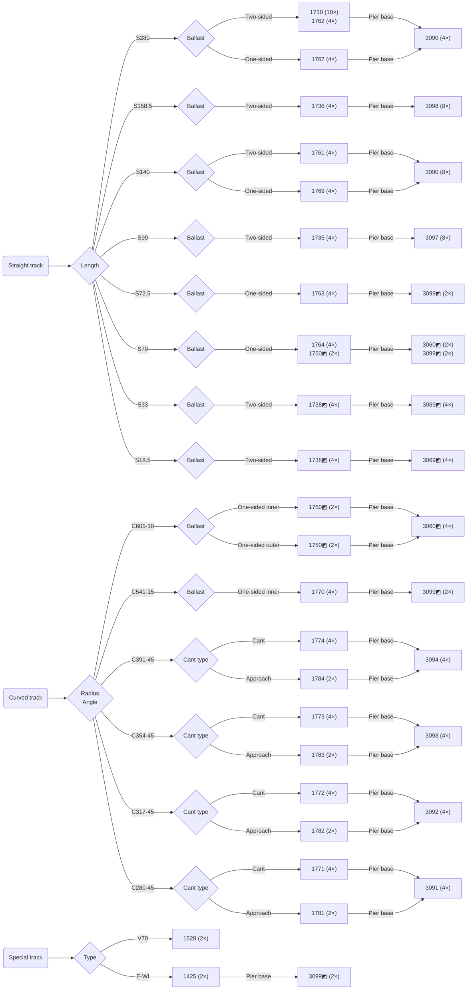
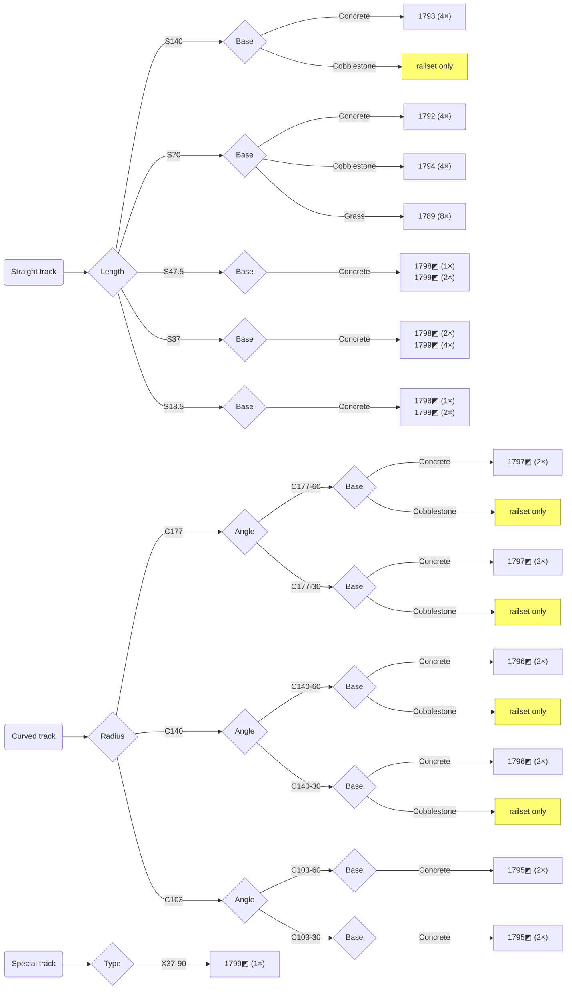
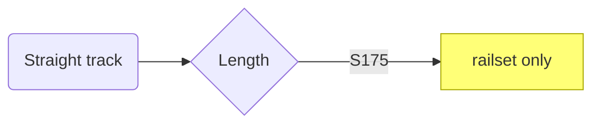
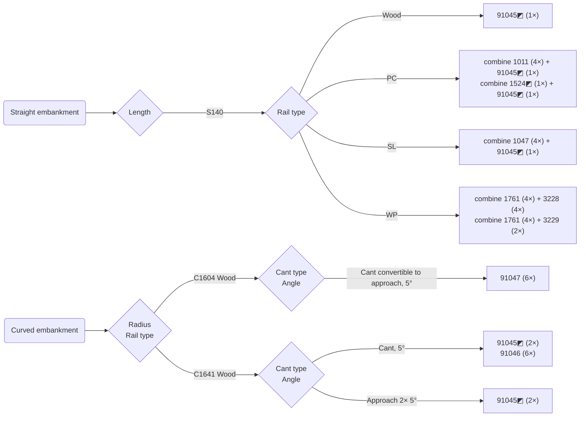

For turnouts, crossing rails, bridges, viaducts without tracks, and turntable, see [table view](tomix.md).

# Wood

```mermaid
graph LR
    classDef cancelled fill:#fbb,stroke:#f22;
    classDef railsetonly fill:#ff7,stroke:#aa0;

    Si(Straight track) --> S{Length}
    S --->|S280| S280["1802 (4×)<br>1092 (10×)"]
    S --->|S158.5| S158_5["1806 (4×)"]
    S --->|S140| S140["1801 (4×)<br>1523◩ (1×)"]
    S --->|S99| S99["1805 (4×)"]
    S --->|S72.5| S72_5["1803 (4×)<br>1421◩❗ (1×)"]
    S --->|S70| S70["1804 (4×)"]
    S --->|S35| S35["1529 (4×)"]
    S --->|S33| S33["1099◩ (2×)<br>1324◩ (4×)"]
    S --->|S18.5| S18_5["1099◩ (2×)<br>1324◩ (4×)"]

    Ci(Curved track) --> C{Radius}
    C --->|C605| C605{Angle}
    C605 -->|C605-10| C60510["1870 (4×)"]
    C --->|C541| C541{Angle}
    C541 -->|C541-15| C54115["1853 (4×)"]
    C --->|C391| C391{Angle}
    C391 -->|C391-45| C39145["1858 (4×)"]
    C391 -->|C391-15| C39115["1145 (2×) ❌"]:::cancelled
    C --->|C354| C354{Angle}
    C354 -->|C354-45| C35445["1856 (4×)"]
    C354 -->|C354-15| C35415["1144 (2×) ❌"]:::cancelled
    C --->|C317| C317{Angle}
    C317 -->|C317-45| C31745["1852 (4×)"]
    C317 -->|C317-15| C31715["1127 (2×) ❌"]:::cancelled
    C --->|C280| C280{Angle}
    C280 -->|C280-45| C28045["1851 (4×)"]
    C280 -->|C280-15| C28015["1854 (4×)"]
    C --->|C243| C243{Angle}
    C243 -->|C243-45| C24345["1855 (4×)"]
    C243 -->|C243-15| C24315["1143 (2×) ❌"]:::cancelled
    C --->|C177| C177{Angle}
    C177 -->|C177-60| C17760["1113◩ (2×)"]
    C177 -->|C177-30| C17730["1113◩ (2×)"]
    C --->|C140| C140{Angle}
    C140 -->|C140-60| C14060["1112◩ (2×)"]
    C140 -->|C140-30| C14030["1112◩ (2×)<br>1231◩ (1×)<br>1232◩ (1×)"]
    C --->|C103| C103{Angle}
    C103 -->|C103-60| C10360["1111◩ (2×)"]
    C103 -->|C103-30| C10330["1111◩ (2×)"]

    HSi(Straight viaduct) -->|Single-track| HS{Length}
    HS --->|HS280| HS280["1072 (2×) ❌"]:::cancelled
    HS --->|HS158.5| HS158_5["1076 (2×) ❌"]:::cancelled
    HS --->|HS140| HS140["1071 (2×) ❌"]:::cancelled
    HS --->|HS99| HS99["1075 (2×) ❌"]:::cancelled
    HS --->|HS70| HS70["combine 3064 (1×) + 1804 (4×)"]

    HCi(Curved viaduct) -->|Single-track| HC{Radius<br>Angle}
    HC --->|HC391-45| HC39145["1174 (2×) ❌"]:::cancelled
    HC --->|HC354-45| HC35445["1172 (2×) ❌"]:::cancelled
    HC --->|HC317-45| HC31745["1171 (2×) ❌"]:::cancelled
    HC --->|HC280-45| HC28045["1173 (2×) ❌"]:::cancelled
    
    spi(Special track) --> sp{Type}
    sp --->|S140-RE| S140RE["1523◩ (1×)"]
    sp --->|S140 cleaning rail| S140CL["6414 (1×) ❌"]:::cancelled
    sp --->|V70| V70["1525 (1×)"]
    sp --->|M70| M70["1521 (1×)"]
    sp --->|G70-W| G70W["1671 (1×)<br>1633◩ (1×)"]
    sp --->|E| E["1421◩ (1×)<br>1297◩ (2×)<br>1298◩ (2×)"]
    sp --->|E-LED| ELED["1422 (1×) ❌"]:::cancelled
```

# PC

```mermaid
graph LR
    classDef cancelled fill:#fbb,stroke:#f22;
    classDef railsetonly fill:#ff7,stroke:#aa0;

    Si(Straight track) ---> S{Length}
    S --->|S280| S280["1012 (4×)<br>1093 (12×)"]
    S --->|S158.5| S158_5["1016 (4×)"]
    S --->|S140| S140["1011 (4×)<br>1524◩ (1×)"]
    S --->|S99| S99["1015 (4×)"]
    S --->|S72.5| S72_5["1013 (4×)"]
    S --->|S70| S70["1014 (4×)"]
    S --->|S35| S35["1530 (4×)"]

    Ci(Curved track) ---> C{Radius}
    C --->|C605| C605{Angle}
    C605 -->|C605-10| C60510["1190 (4×)"]
    C --->|C541| C541{Angle}
    C541 -->|C541-15| C54115["1193 (4×)"]
    C --->|C391| C391{Angle}
    C391 -->|C391-45| C39145["1198 (4×)"]
    C391 -->|C391-15| C39115["1865 (2×)"]
    C --->|C354| C354{Angle}
    C354 -->|C354-45| C35445["1196 (4×)"]
    C354 -->|C354-15| C35415["1864 (2×)"]
    C --->|C317| C317{Angle}
    C317 -->|C317-45| C31745["1192 (4×)"]
    C317 -->|C317-15| C31715["1197 (2×)"]
    C --->|C280| C280{Angle}
    C280 -->|C280-45| C28045["1191 (4×)"]
    C280 -->|C280-15| C28015["1194 (4×)"]
    C --->|C243| C243{Angle}
    C243 -->|C243-45| C24345["1195 (4×)"]
    C243 -->|C243-15| C24315["1863 (2×)"]

    HSi(Straight viaduct) --->|Single-track| HS{Length}
    HS --->|HS280| HS280["1822 (4×)"]
    HS --->|HS158.5| HS158_5["1826 (4×)"]
    HS --->|HS140| HS140["1821 (4×)"]
    HS --->|HS99| HS99["1825 (4×)"]
    HS --->|HS70| HS70["combine 3064 (1×) + 1014 (4×)"]

    HCi(Curved viaduct) --->|Single-track| HC{Radius<br>Angle}
    HC --->|HC541-15| HC54115["1876 (4×)"]
    HC --->|HC391-45| HC39145["1874 (4×)"]
    HC --->|HC354-45| HC35445["1872 (4×)"]
    HC --->|HC317-45| HC31745["1871 (4×)"]
    HC --->|HC280-45| HC28045["1873 (4×)"]
    
    HSi --->|Double-track| DS{Length}
    DS --->|DS1120| DS1120["1819 (2×)"]
    DS --->|DS280| DS280["1812 (2×)"]
    DS --->|DS140| DS140["1811 (2×)"]

    HCi --->|Double-track| DC{Radius<br>Angle}
    DC --->|DC465/428-45| DC465428["1883 (2×)"]
    DC --->|DC391/354-45| DC391354["1882 (2×)"]
    DC --->|DC317/280-45| DC317280["1881 (2×)"]

    spi(Special track) ---> sp{Type}
    sp --->|S140-RE| S140RE["1524◩ (1×)"]
    sp --->|S140 cleaning rail| S140CL["6415 (1×)"]
    sp --->|V70| V70["1526 (1×)"]
    sp --->|S35 with crossing| S35C["railset only"]:::railsetonly
    sp --->|E-LED| ELED["1428 (1×)"]
```

# SL

```mermaid
graph LR
    classDef cancelled fill:#fbb,stroke:#f22;
    classDef railsetonly fill:#ff7,stroke:#aa0;

    Si(Straight track) --> S{Length}
    S --->|S280| S280["1048 (4×)"]
    S --->|S140| S140["1047 (4×)"]

    Ci(Curved track) --> C{Radius<br>Angle}
    C --->|C605-10| C60510["railset only"]:::railsetonly

    DSi(Straight viaduct) -->|Double-track| DS{Length}
    DS --->|DS1120| DS1120["1070 (2×)"]
    DS --->|DS280| DS280["1067 (2×)"]
    DS --->|DS140| DS140["1066 (2×)"]

    DCi(Curved viaduct) -->|Double-track| DC{Radius<br>Angle}
    DC --->|DC539/502-22.5| DC539502["1169 (2×)"]
    DC --->|DC465/428-45| DC465428["1168 (2×)"]

    spi(Special track) --> sp{Type}
    sp --->|E-LED| ELED["1423 (1×)"]
```

# WP + WI

```mermaid
graph LR
    classDef cancelled fill:#fbb,stroke:#f22;
    classDef railsetonly fill:#ff7,stroke:#aa0;

    Si(Straight track) --> S{Length}
    S --->|S280| S280{Ballast}
    S280 --->|Two-sided| S280TS["1730 (10×)<br>1762 (4×)"]
    S280 --->|One-sided| S280OS["1767 (4×)"]
    S --->|S158.5| S1585{Ballast}
    S1585 --->|Two-sided| S1585TS["1736 (4×)"]
    S --->|S140| S140{Ballast}
    S140 --->|Two-sided| S140TS["1761 (4×)"]
    S140 --->|One-sided| S140OS["1769 (4×)"]
    S --->|S99| S99{Ballast}
    S99 --->|Two-sided| S99TS["1735 (4×)"]
    S --->|S72.5| S725{Ballast}
    S725 --->|One-sided| S725OS["1763 (4×)"]
    S --->|S70| S70{Ballast}
    S70 --->|One-sided| S70OS["1764 (4×)<br>1750◩ (2×)"]
    S --->|S33| S33{Ballast}
    S33 --->|Two-sided| S33TS["1738◩ (4×)"]
    S --->|S18.5| S185{Ballast}
    S185 --->|Two-sided| S185TS["1738◩ (4×)"]
    
    S280TS & S280OS --->|Pier base| HS280["3090 (4×)"]
    S1585TS --->|Pier base| HS1585["3098 (8×)"]
    S140TS & S140OS --->|Pier base| HS140["3090 (8×)"]
    S99TS --->|Pier base| HS99["3097 (8×)"]
    S725OS --->|Pier base| HS725["3099◩ (2×)"]
    S70OS --->|Pier base| HS70["3060◩ (2×)<br>3099◩ (2×)"]
    S33TS --->|Pier base| HS33["3069◩ (4×)"]
    S185TS --->|Pier base| HS185["3069◩ (4×)"]

    Ci(Curved track) --> C{Radius<br>Angle}
    C --->|C605-10| C605{Ballast}
    C605 --->|One-sided inner| C605OSI["1750◩ (2×)"]
    C605 --->|One-sided outer| C605OSO["1750◩ (2×)"]
    C --->|C541-15| C541{Ballast}
    C541 --->|One-sided inner| C541OSI["1770 (4×)"]
    C --->|C391-45| C391{Cant type}
    C391 --->|Cant| C391C["1774 (4×)"]
    C391 --->|Approach| C391A["1784 (2×)"]
    C --->|C354-45| C354{Cant type}
    C354 --->|Cant| C354C["1773 (4×)"]
    C354 --->|Approach| C354A["1783 (2×)"]
    C --->|C317-45| C317{Cant type}
    C317 --->|Cant| C317C["1772 (4×)"]
    C317 --->|Approach| C317A["1782 (2×)"]
    C --->|C280-45| C280{Cant type}
    C280 --->|Cant| C280C["1771 (4×)"]
    C280 --->|Approach| C280A["1781 (2×)"]

    C605OSI & C605OSO --->|Pier base| HC60510["3060◩ (4×)"]
    C541OSI --->|Pier base| HC54115["3099◩ (2×)"]
    C391C & C391A --->|Pier base| HC39145["3094 (4×)"]
    C354C & C354A --->|Pier base| HC35445["3093 (4×)"]
    C317C & C317A --->|Pier base| HC31745["3092 (4×)"]
    C280C & C280A --->|Pier base| HC28045["3091 (4×)"]

    spi(Special track) --> sp{Type}
    sp --->|V70| V70["1528 (2×)"]
    sp --->|E-WI| E["1425 (2×)"]

    E --->|Pier base| HE["3099◩ (2×)"]
```

# WT + WT-S + WT-G

```mermaid
graph LR
    classDef cancelled fill:#fbb,stroke:#f22;
    classDef railsetonly fill:#ff7,stroke:#aa0;

    Si(Straight track) --> S{Length}
    S --->|S140| S140{Base}
    S140 --->|Concrete| S140C["1793 (4×)"]
    S140 --->|Cobblestone| S140S["railset only"]:::railsetonly
    S --->|S70| S70{Base}
    S70 --->|Concrete| S70C["1792 (4×)"]
    S70 --->|Cobblestone| S70S["1794 (4×)"]
    S70 --->|Grass| S70G["1789 (8×)"]
    S --->|S47.5| S475{Base}
    S475 --->|Concrete| S475C["1798◩ (1×)<br>1799◩ (2×)"]
    S --->|S37| S37{Base}
    S37 --->|Concrete| S37C["1798◩ (2×)<br>1799◩ (4×)"]
    S --->|S18.5| S185{Base}
    S185 --->|Concrete| S185C["1798◩ (1×)<br>1799◩ (2×)"]

    Ci(Curved track) --> C{Radius}
    C --->|C177| C177{Angle}
    C177 -->|C177-60| C17760{Base}
    C17760 --->|Concrete| C17760C["1797◩ (2×)"]
    C17760 --->|Cobblestone| C17760S["railset only"]:::railsetonly
    C177 -->|C177-30| C17730{Base}
    C17730 --->|Concrete| C17730C["1797◩ (2×)"]
    C17730 --->|Cobblestone| C17730S["railset only"]:::railsetonly
    C --->|C140| C140{Angle}
    C140 -->|C140-60| C14060{Base}
    C14060 --->|Concrete| C14060C["1796◩ (2×)"]
    C14060 --->|Cobblestone| C14060S["railset only"]:::railsetonly
    C140 -->|C140-30| C14030{Base}
    C14030 --->|Concrete| C14030C["1796◩ (2×)"]
    C14030 --->|Cobblestone| C14030S["railset only"]:::railsetonly
    C --->|C103| C103{Angle}
    C103 -->|C103-60| C10360{Base}
    C10360 --->|Concrete| C10360C["1795◩ (2×)"]
    C103 -->|C103-30| C10330{Base}
    C10330 --->|Concrete| C10330C["1795◩ (2×)"]

    spi(Special track) --> sp{Type}
    sp --->|X37-90| X3790["1799◩ (1×)"]
```

# PT

```mermaid
graph LR
    classDef cancelled fill:#fbb,stroke:#f22;
    classDef railsetonly fill:#ff7,stroke:#aa0;

    Si(Straight track) --> S{Length}
    S --->|S175| S175["railset only"]:::railsetonly
```

# EM

```mermaid
graph LR
    classDef cancelled fill:#fbb,stroke:#f22;
    classDef railsetonly fill:#ff7,stroke:#aa0;

    Si(Straight embankment) --> S{Length}
    S --->|S140| S140{Rail type}
    S140 --->|Wood| S140W["91045◩ (1×)"]
    S140 --->|PC| S140PC["combine 1011 (4×) + 91045◩ (1×)<br>combine 1524◩ (1×) + 91045◩ (1×)"]
    S140 --->|SL| S140SL["combine 1047 (4×) + 91045◩ (1×)"]
    S140 --->|WP| S140WP["combine 1761 (4×) + 3228 (4×)<br>combine 1761 (4×) + 3229 (2×)"]

    Ci(Curved embankment) --> C{Radius<br>Rail type}
    C --->|C1604 Wood| C1604{Cant type<br>Angle}
    C --->|C1641 Wood| C1641{Cant type<br>Angle}
    C1604 --->|"Cant convertible to approach, 5°"| C1604CA["91047 (6×)"]
    C1641 --->|"Cant, 5°"| C1641C["91045◩ (2×)<br>91046 (6×)"]
    C1641 --->|"Approach 2× 5°"| C1641A["91045◩ (2×)"]
```
